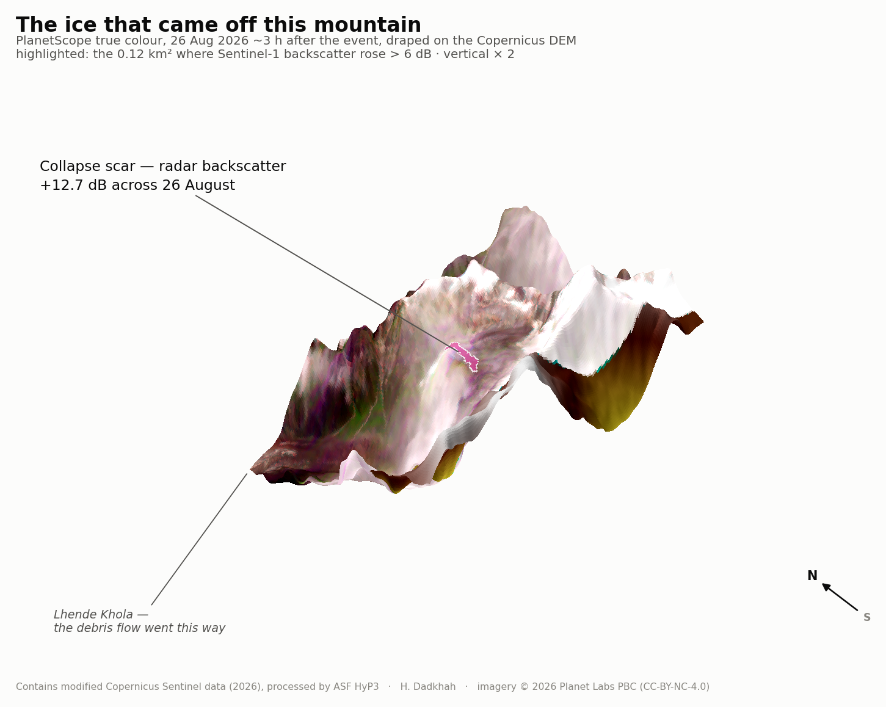

# Sentinel-1 backscatter change detection — 2026 Lhende Khola glacier collapse



Detects the collapse scar of the 26 August 2026 Lhende Khola (Nepal) glacier
collapse from Sentinel-1 backscatter: pixels whose γ⁰ VV rose by more than
6 dB between the last pre-event and the first post-event acquisition, masked
on local incidence angle (20–70°), clustered (≥ 8 connected pixels).

## Data

**Sentinel-1 RTC γ⁰ (VV, 30 m)** — five acquisitions, IW mode, ascending
track 85:

| date | role |
|---|---|
| 2026-07-11 | pre-event |
| 2026-07-23 | pre-event |
| 2026-08-04 | pre-event |
| 2026-08-16 | last pre-event |
| 2026-08-28 | post-event |

Processed on demand with [ASF HyP3](https://hyp3-docs.asf.alaska.edu/)
(`RTC_GAMMA`, 30 m, gamma-0, DEM-matched). Order via
[ASF Vertex](https://search.asf.alaska.edu/) or the `hyp3_sdk`, then place the
five product zips in `data/rtc/` — the script reads the layers straight out of
the zips, no unpacking needed.

**Copernicus GLO-30 DEM and local incidence angle** — shipped inside each HyP3
RTC product (`*_dem.tif`, `*_inc_map.tif`), on the same 30 m grid as the
backscatter.

## Run

```bash
pip install rasterio numpy scipy pillow
python change_detection.py
```

## Output

`outputs/source_zone_scar.kmz` — the detected scar polygon on a shaded
Copernicus DEM background; opens directly in Google Earth and QGIS. The
polygon edge follows the 30 m detection pixels — jagged on purpose: it is the
detector's footprint, not a drawn outline.

---

Contains modified Copernicus Sentinel data (2026), processed by ASF HyP3.
Header image: PlanetScope true colour (26 Aug 2026) draped on the Copernicus
DEM — imagery © 2026 Planet Labs PBC (CC-BY-NC-4.0).
